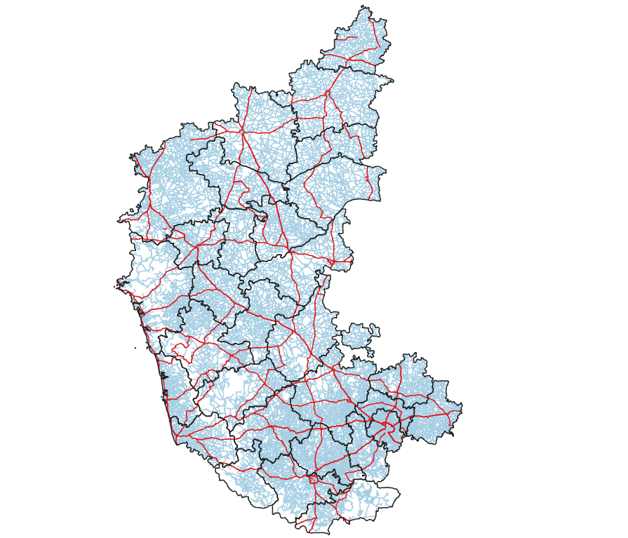

#+title: Advanced QGIS Projects
#+author: mgd

This portfolio showcases a collection of GIS projects I have created using QGIS from the [[https://spatialthoughts.com/courses/introduction-to-qgis/][Spatial Thoughts Advanced QGIS Course]]

Each project demonstrates advanced QGIS techniques such as:

- Processing Framework - Algorithms, Batch processing, and Modeler
- Animating time-series data
- 3D fly-through from aerial imagery
- Advanced Expressions

*** Project 1: Karnataka Roads

This project demonstrates the use of the Processing Toolbox as an alternative to the manual methods employed in previous projects. The goal is to build towards automation using these tools. The Processing Toolbox also provides access to external tools such as GDAL, GRASS, and SAGA.

Our first task was to find the length of all National Highway roads in the Indian state of Karnataka. The dataset contained various types of roads, so we applied a filter to create a layer with only the National Highways. This was accomplished using the *Extract by Expression* tool, which allowed us to filter the data using a regular expression (RegEx) pattern specifically for National Highways.

The dataset used the Geographic CRS EPSG:4326, which defines locations on the Earth's surface using latitude and longitude. Since these coordinates are given in degrees, they are not suitable for calculating distances, as they do not represent a uniform scale across the globe. The *Add Geometry Attributes* tool enables us to use ellipsoidal mathematics, resulting in a new vector layer that includes the length of each segment.

We now have the lengths in meters. We can use the **Field Calculator** to convert these values into kilometers. With the lengths correctly calculated, the *Basic Statistics for Fields* tool can be used to generate various statistics for our newly calculated length in kilometers, yielding an approximate total of 8,616 Kilometres.

Next, we were tasked with calculating the length of National Highways for each district in the state. This required performing a spatial join with a vector layer containing district boundaries. We used the *Join Attributes by Location* tool to create a one-to-one join, ensuring that each highway feature is allocated to one district. One challenge we encountered was that some roads cross district boundaries. We addressed this by assigning the highway to the district with the largest overlap. Alternatively, the *Sum Line Lengths* tool could have been used to obtain accurate line lengths contained within each polygon.

With this new layer, we can utilize the *Statistics by Categories* tool to generate similar statistics to those produced by the *Basic Statistics for Fields* tool. This provides us with a number of useful statistics, including the sum.

Finally, we performed data transformation on the final statistics layer to enhance readability. This involved removing unnecessary fields, renaming the remaining fields for consistency, and rounding the lengths. The final output is presented below:

| fid | district         | length_km |
|   1 | Hassan           |       430 |
|   2 | Chamrajnagar     |       209 |
|   3 | Dakshina Kannada |       318 |
|   4 | Tumkur           |       514 |
|   5 | Raichur          |       167 |
|   6 | Bellary          |       313 |
|   7 | Dharwad          |       290 |
|   8 | Bagalkot         |       241 |
|   9 | Gadag            |       118 |
|  10 | Shimoga          |       447 |
|  11 | Chitradurga      |       480 |
|  12 | Gulbarga         |       291 |
|  13 | Yadgir           |       140 |
|  14 | Bijapur          |       399 |
|  15 | Belgaum          |       504 |
|  16 | Udupi            |       268 |
|  17 | Bangalore        |       304 |
|  18 | Mysore           |       340 |
|  19 | Kodagu           |        60 |
|  20 | Bangalore Rural  |       309 |
|  21 | Mandya           |       248 |
|  22 | Chikkaballapura  |       210 |
|  23 | Chikmagalur      |       278 |
|  24 | Davanagere       |       126 |
|  25 | Koppal           |       269 |
|  26 | Uttara Kannada   |       425 |
|  27 | Kolar            |       170 |
|  28 | Haveri           |       288 |
|  29 | Ramanagara       |       217 |
|  30 | Bidar            |       247 |

Data was obtained from:
- /Admin and District Boundaries/: [[https://projects.datameet.org/maps/][DataMeet]]
- /Roads/: [[https://www.openstreetmap.org/relation/2019939][OpenStreetMap]]
  

 
